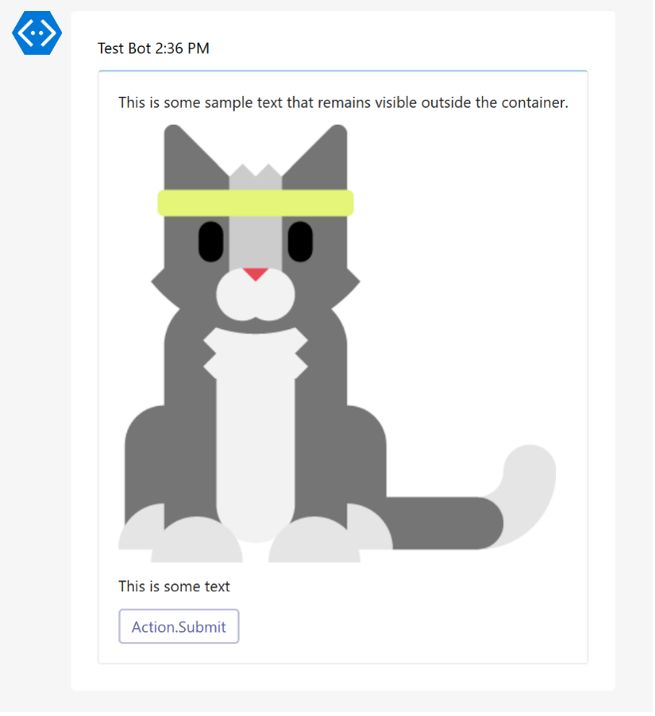
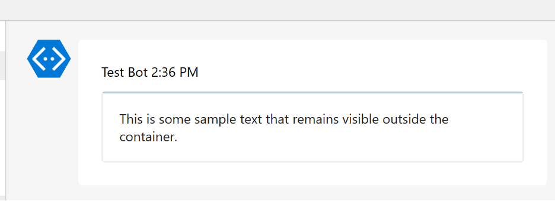

# Template Design Guidance

## A basic Adaptive Card template

The following is an example of the basic structure of an Adaptive Card template a Teams bot would need for rendering to the user:

```jsonc
{
 "$schema": "http://adaptivecards.io/schemas/adaptive-card.json",
 "version": "1.3",
 "type": "AdaptiveCard",
 "body": [
  // Any components of the adaptive card body...
 ],
 "actions": [
  // Any buttons with actions at the bottom of the card...
 ]
}
```

## Populating data into templates

To dynamically populate payload data into a template using the adapter, the default templating language has support for variable names wrapped in `${}`.

There is also a special field name, `$data`, which is used for populating data from an array.

Example template: `simpleTextWithDropdown`

```json
{
 "$schema": "http://adaptivecards.io/schemas/adaptive-card.json",
 "version": "1.3",
 "type": "AdaptiveCard",
 "body": [
  {
   "type": "TextBlock",
   "size": "Medium",
   "text": "${text}",
   "wrap": true
  },
  {
   "type": "Input.ChoiceSet",
   "id": "selected",
   "label": "Select from below:",
   "isRequired": true,
   "errorMessage": "${errorMessage}",
   "choices": [
    {
     "$data": "${options}",
     "title": "${title}",
     "value": "${value}"
    }
   ]
  }
 ],
 "actions": [
  {
   "type": "Action.Submit",
   "title": "Submit"
  }
 ]
}
```

The following is an example of some payload data to be transformed into an adaptive card. Note that the payload field names map to the corresponding values in the template wrapped in `${}` (e.g. `text`, `errorMessage`, `options`, and `title`).

Example payload: _i.e. from a backend API response_

```json
{
 "cardTemplateType": "simpleTextWithDropdown",
 "text": "What color do you prefer?",
 "errorMessage": "Please select one of the options",
 "options": [
  {
   "title": "Red",
   "value": "red"
  },
  {
   "title": "Green",
   "value": "green"
  },
  {
   "title": "Blue",
   "value": "blue"
  }
 ]
}
```

The `templateTransformer.ts` from the adapter uses the [`adaptivecards-templating`](https://www.npmjs.com/package/adaptivecards-templating?activeTab=readme) library to then populate the template appropriately in the following `process()` function:

```ts
/**
 * Combine the data and the template to produce a new Adaptive Card
 *
 * @param data DialogPayload JSON
 * @param cardTemplate Adaptive card template
 * @returns Populated adaptive card object
 */
export function process(data, cardTemplate) {
 const template = new ACData.Template(cardTemplate)
 return template.expand({
  $root: data,
 })
}
```

## Customizing the formatting of an Adaptive Card

To see all the available properties and values for Adaptive Cards, take a look at the official [Adaptive Card Schema Explorer](https://adaptivecards.io/explorer/).

The official docs also provides a useful playground for designing Adaptive Cards in realtime. See the [Adaptive Card Designer](https://adaptivecards.io/designer/).

## Easy Hiding of Adaptive Card Controls

### ActionSet for easy hiding

[ActionSet](https://adaptivecardsci.z5.web.core.windows.net/pr/4005/explorer/ActionSet.html) displays a set of actions in the body of your Adaptive Cards. Because ActionSet is a container, you can to leverage the `isVisible` property to hide specific elements of your card.

Each of the templates in `example/plugins/templateSelector/templates` utilize the ActionSet with `id` and `isVisible` properties populated on the template card.

```json
{
 "$schema": "http://adaptivecards.io/schemas/adaptive-card.json",
 "version": "1.3",
 "type": "AdaptiveCard",
 "body": [
  {
   "type": "TextBlock",
   "size": "Medium",
   "text": "${text}",
   "wrap": true
  },
  {
   "type": "ActionSet",
   "id": "controls",
   "isVisible": true,
   "actions": [
    {
     "type": "Action.Submit",
     "title": "Confirm",
     "data": {
      "response": "confirm"
     }
    }
   ]
  }
 ],
 "actions": []
}
```

You can update the `isVisible` field to `false` in your bot code based on the `id` of the ActionSet. For example, please refer to the `sendUpdateCard(context: TurnContext)` method in the [bot code].

[bot code]: ../example/bot/bot.ts

### Containers for easy hiding

Placing all the "input" controls into a container in the adaptive card allows the visibility of all controls inside the container to be toggled from hidden (e.g., `"isVisible": false`) to visible (e.g., `"isVisible": true`). This the visibility of the container controls the visibility of all contained controls. Please see the example below.

Below is the image when the container visible:



Below is the image when the container hidden. Notice the controls in the container as also hidden. In this case a text field and a button.



Below is the JSON for the card pictured above. Note the container, the controls in the container and its isVisible property.

```json
{
 "$schema": "http://adaptivecards.io/schemas/adaptive-card.json",
 "type": "AdaptiveCard",
 "version": "1.2",
 "body": [
  {
   "type": "Container",
   "isVisible": false,
   "items": [
    {
     "type": "Image",
     "url": "https://adaptivecards.io/content/cats/1.png"
    },
    {
     "type": "TextBlock",
     "text": "This is some text"
    },
    {
     "type": "ActionSet",
     "actions": [
      {
       "type": "Action.Submit",
       "title": "Action.Submit"
      }
     ]
    }
   ]
  }
 ]
}
```

## Reference

- How to update/delete bot messages (<https://docs.microsoft.com/en-us/microsoftteams/platform/bots/how-to/update-and-delete-bot-messages?tabs=typescript>)

- Disabling buttons in Adaptive cards in Teams after user selection - C# (<https://github.com/microsoft/botframework-sdk/issues/5472>)
